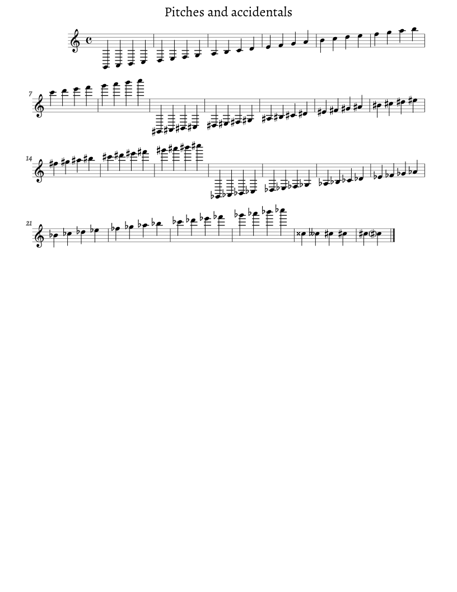
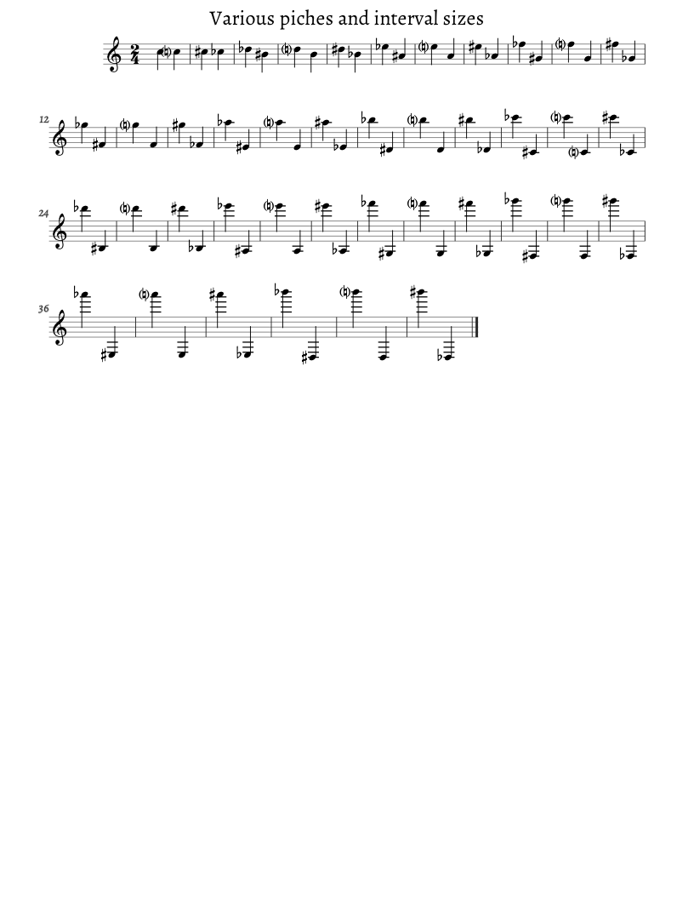
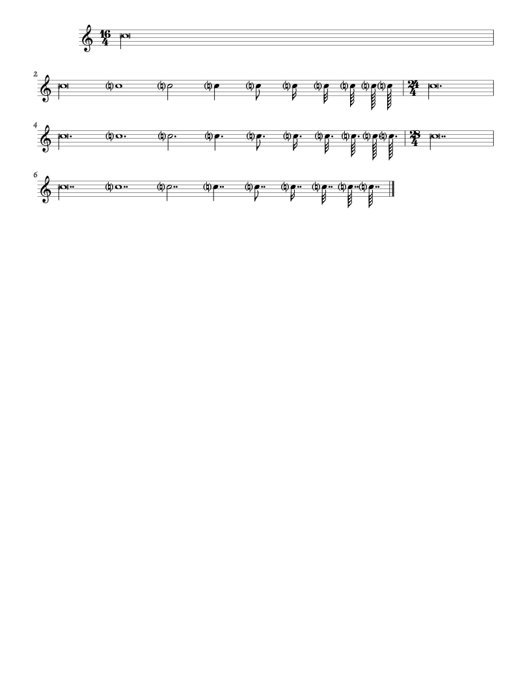
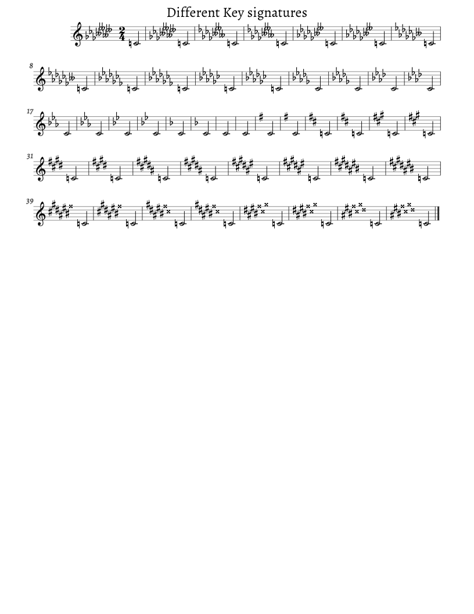
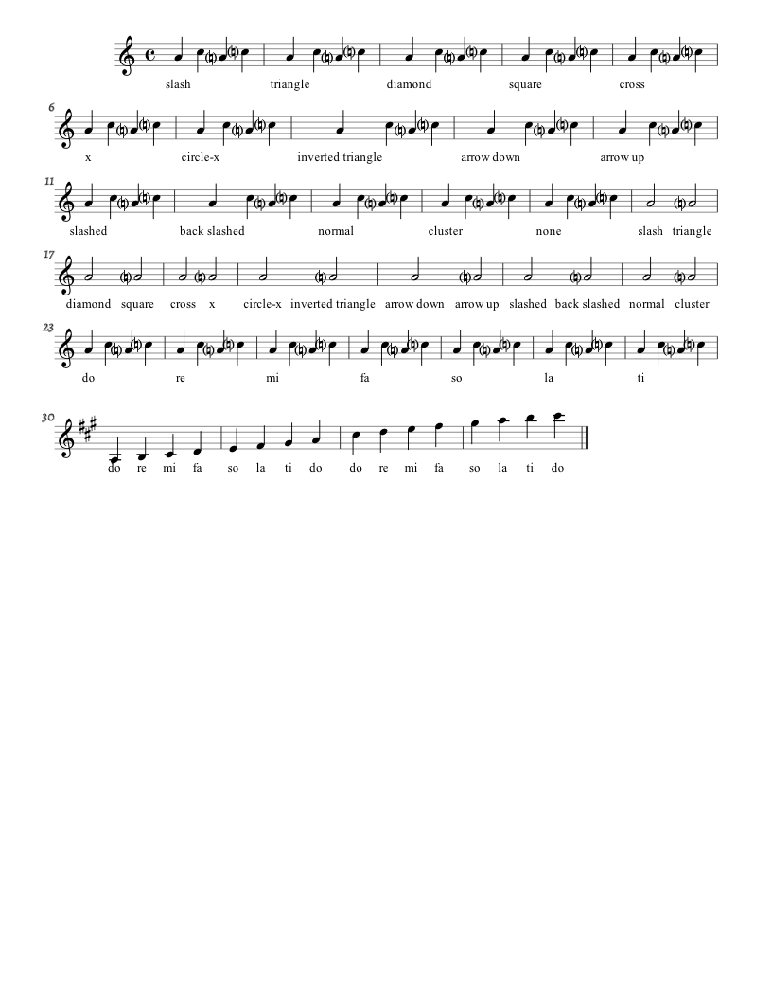
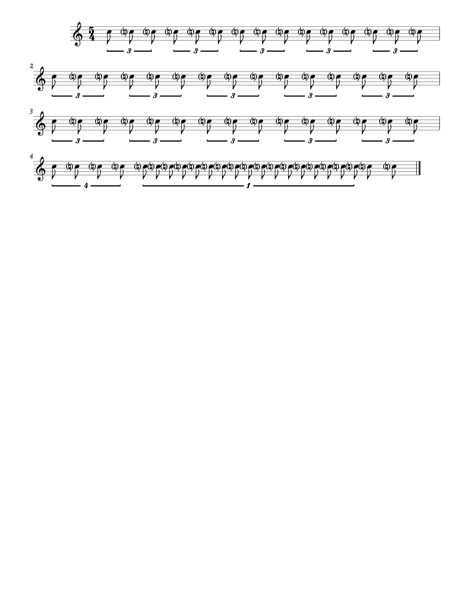

# MusicXML Compliance Status
Satie uses [http://lilypond.org/doc/v2.18/input/regression/musicxml/collated-files](the unofficial MusicXML test suite) to verify MusicXML compliance, and to avoid regressions.

TODO: Attach screenshots.
TODO: Automate regression testing.

## Legend
 | Meaning
:-:|:--
✓ | Passes
≈ | Minor issues
✗ | Major Issues
☢ | Error
 | Not tested

## 01. Pitches
|   |                                     |   | Screenshot and Notes
----|-------------------------------------|:-:|----------------------------------------------------------------
01a | Pitches and accidentals             | ✓ |  Lilypond incorrectly puts parentheses around cautionary accidentals instead of editorial accidentals
01b | Intervals                           | ✓ |  Includes automatic cautionaries because an accidental is not specified.
01c | No Voice Element                    | ✓ | 
01d | Microtones                          | ✓ |  Not reflected in playback
01e | Parenthesized Accidentals           | ✓ |  Lilypond incorrectly puts parentheses around cautionary accidentals instead of editorial accidentals
01f | Parenthesized Microtone Accidentals | ✓ |  Ditto.

## 02. Rests
|   |                                     |   | Notes
----|-------------------------------------|:-:|----------------------------------------------------------------
02a | Rest unit test                      | ✓ |  Uses modern multi-measure rests.
02b | Pitched Rests                       | ✓ |  Differences appear because Bravura rests are slightly shorter.
02c | Multi Measure Rests                 | ✓ |  Uses modern multi-measure rests.
02d | Multi Measure Rests + TS            | ✓ |  Uses modern multi-measure rests.
02e | No Type                             | ✗ |  Engraved property ignored, grand-staff barlines not working, and there needs to be another voice for stave 2, bar 2

## 03. Rhythm
|   |                                     |   | Notes
----|-------------------------------------|:-:|----------------------------------------------------------------
03a | Durations                           | ✓ |  
03b | Backup                              | ✗ |  Engraved property ignored, and voice 2, implicit beats should be hidden, stem directions should be set by voice.
03c | Division Change                     | ✓ | 
03d | Dotted Duration Factors             | ✓ |  Lilypond uses a traditional rest for bar 16.

## 11. Time Signatures
|   |                                     |   | Notes
----|-------------------------------------|:-:|----------------------------------------------------------------
11a | Time Signatures                     | ✓ |  
11b | No Time                             | ≈ |  Barlines should be grand-staff barlines
11c | Compound Simple                     | ✗ |  Beaming, spell out compound TS
11d | Compound Multiple                   | ✗ |  Beaming, spell out compound TS, long note should not have stem
11e | Compound Mixed                      | ✗ |  Beaming, spell out compound TS
11f | Symbol Meaning                      | ✓ |  Symbol should take precedence over TS, as in Finale
11g | Single Number                       | ✗ |  Single number, beaming
11h | Senza Misura                        | ☢ |  

## 12. Clefs
|   |                                     |   | Notes
----|-------------------------------------|:-:|----------------------------------------------------------------
12a | Clefs                               | ✗ |  Octave shifts not rendered, tab on wrong line
12b | No Key or Clef                      | ✓ | 

## 13. Key Signatures
|   |                                     |   | Notes
----|-------------------------------------|:-:|----------------------------------------------------------------
13a | Key Signatures                      | ≈ |  Extra spacing should be given to double flats/sharps
13b | Church Modes                        | ✓ |  Not sure what this tests
13c | Non Traditional                     | ✗ |  Not rendered or acknowledged
13d | Microtones                          | ✗ |  Not rendered or acknowledged

## 14. Staff attributes
|   |                                     |   | Notes
----|-------------------------------------|:-:|----------------------------------------------------------------
14a | Line Changes                        | ✗ |  No line changes, no brace, no vertical seperation

## 21. Chords
|   |                                     |   | Notes
----|-------------------------------------|:-:|----------------------------------------------------------------
21a | Basic                               | ✓ |  
21b | Two Notes                           | ✓ |  
21c | Three Notes Duration                | ✓ |  
21d | Schubert, Stabat, Mater             | ✗ |  Ornaments and directions ignored
21e | Pickup Measures                     | ✓ |  Nit: Pickup measures should not be given additional space.
21f | Elements in Between                 | ✗ |  Elements not rendered

## 22. Note settings, heads, etc.
|   |                                     |   | Notes
----|-------------------------------------|:-:|----------------------------------------------------------------
22a | Noteheads                           | ✗ |  Noteheads ignored
22b | Note styles                         | ✗ |  Note styles ignored. Lilypond ignores note styles.
22c | Noteheads chords                    | ✗ |  Noteheads ignored, overlapping text
22d | Parenthesized Noteheads             | ✗ |  Ignored

## 23. Tuplets
|   |                                     |   | Notes
----|-------------------------------------|:-:|----------------------------------------------------------------
23a | Tuplets                             | ✓ |  Closing brace should fully cover start/end
23b | Styles                              | ✗ |  Nope.
23c | Non Standard                        | ✗ |  Nope.
23d | Nested                              | ✗ |  Flipped brace, no beams
23e | Tremelo                             | ☢ |  Unterminated beam!!!
23f | Duration without bracker            | ☢ |  [object Object]

## 24. Grace Notes
|   |                                     |   | Notes
----|-------------------------------------|:-:|----------------------------------------------------------------
24a | Grace Notes                         | ✗ |  Missing beams
24b | Chords as grace notes               | ✗ |  Missing slashes
24c | Measure End                         | ✗ |  Missing beams
24d | After Grace                         | ✗ |  Missing beams
24e | Nested                              | ✗ |  Flipped brace, no beams
24f | Staff Change                        | ✗ |  Missing beam, bad metre completion which should be invisible anyway, missing voice in bottom staff.
24g | Slur                                | ✗ |  No slur

## 31. Directions  
|   |                                     |   | Notes
----|-------------------------------------|:-:|----------------------------------------------------------------
31a | Directions                          | ✗ |  No directions
31c | Metronome Marks                     | ✗ |  No metronome marks

## 32. Notations and Articulations
|   |                                     |   | Notes
----|-------------------------------------|:-:|----------------------------------------------------------------
32a | Notations                           | ✗ |  No notations
32b | Articulations Texts                 | ✗ |  No articulation texts
32c | Multiple Notation Children          | ✗ |  Natural (bug in test). No notations.
32d | Arpeggio                            | ✗ |  No arpeggios

## 33. Spanners
|   |                                     |   | Notes
----|-------------------------------------|:-:|----------------------------------------------------------------
33a | Spanners                            | ✗ |  Renders garbage!
33b | Tie                                 | ✓ |  
33c | Slurs                               | ✗ |  Oh boy.
33d | Octave shifts                       | ✗ |  Beams, visual, rendered octave
33e | Octave shifts, Invalid Size         | ✓ |  Because we ignore all octave shifts
33f | Trill ending on grace note          | ✗ |  Missing beam, missing trill
33g | Chorded notes and slurs             | ✗ |  No slur
33h | Glissando                           | ✗ |  No glissando
33i | Ties, not ended                     | ✗ |  C should be connected to D

## 41. Multiple Parts
✗ No vertical seperation. Several crash.

## 42. Multi voice
☢ All tests crash.

## 43. Multi staff
|   |                                     |   | Notes
----|-------------------------------------|:-:|----------------------------------------------------------------
43a | Piano staff                         | ✗ |  Missing grand staff barlines, should be single bar
43b | Different Keys                      | ✗ |  D major key on wrong bar, should be single bar
43c | Different Keys after Backup         | ✗ |  Renders garbage
43d | Staff change                        | ✗ |  Beams, hide implicit rests, missing rests in staff 2, vertical seperation to large.
43e | Clef Dynamics                       | ✗ |  Beams, visual, rendered octave

## 45. Repeats
✗ No Repeats.

## 46. Barline and Measures
|   |                                     |   | Notes
----|-------------------------------------|:-:|----------------------------------------------------------------
46a | Barlines                            | ✗ |  Fancy barlines appear as normal
46b | Midmeasure Barlines                 | ✓ |  Lilypond output is wrong.
46c | Midmeasure Clefs                    | ✗ |  One barline should be hidden
46d | Implicit Measures                   | ✗ |  Very much explicit.
46e | Late Second Voice                   | ✗ |  Implicit rests rendered, both voices have same stem direction
46f | Incomplete Measures                 | ✓ |  Not reflected in playback
46g | Figured Bass                        | ☢ |  Cannot read property 'length' of null.

## 51. Header Information
☢ All tests error.

## 52. Page layout
☢ All tests error.

## 61. Lyrics
|   |                                     |   | Notes
----|-------------------------------------|:-:|----------------------------------------------------------------
61a | Lyrics                              | ≈ |  Missing syllable spanners.
61b | Multiple lyrics                     | ✗ |  Lyrics rendered on top of each other.
61c | Midmeasure Clefs                    | ≈ |  Except for syllable spanners, as above.
61d | Melisma                             | ✗ |  Melisma, ties, slurs
61e | Lyrics on Chords                    | ✓ |  
61f | Lyrics on Notes with Graces         | ✓ |  
61g | Lyrics with names and numbers       | ✗ |  No defined answer. Overlapping lyrics.
61h | Beams with Melismatas               | ✗ |  No beams. No melismatas.
61i | Multiple lyrics on chords           | ✗ |  Check Finale.
61j | Elisions                            | ✗ |  Overlapping, no elisions
61k | Spanners and extenders              | ✗ |  No spanners or extenders

## 71. Guitar notation
☢ All tests error.

## 72. Transposing instruments
|   |                                     |   | Notes
----|-------------------------------------|:-:|----------------------------------------------------------------
72a | Transposing Instruments             | ✗ |  Overlapping, no transposition
72b | Full                                | ✗ |  Overlapping, no transposition
72c | Change                              | ☢ |  Cannot read property 'length' of null.

## 73. Guitar notation
☢ Cannot read property 'length' of null.

## 74. Figured bass
☢ Cannot read property 'length' of null.

## 75. Other instrumental notation
✗ No accordion registrations.

## 90. Compressed MusicXML files
☢ Cannot read property 'length' of null.

## 99b. Sibelius 5 errata
✗ No beams.
